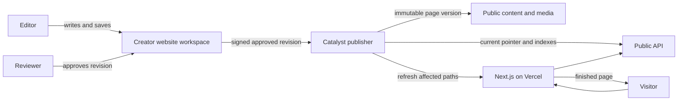
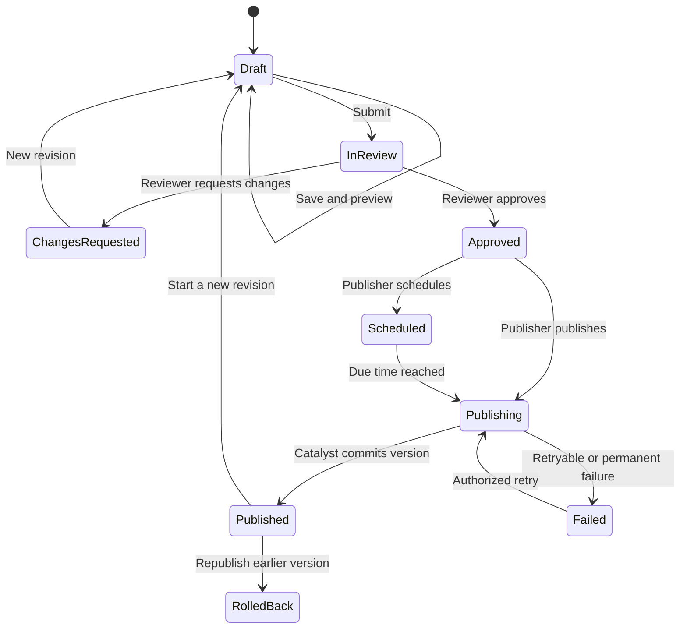

# GeneDrift Phase 2 — Information and Editing Architecture

Prepared: 2026-09-05  
Status: planning baseline; launch scope and visual direction still require selection

## 1. The plain-language model

The website has three connected parts:

1. **Zoho Creator is the private editing office.** GeneDrift staff write content,
   arrange approved section types, review changes and request publication there.
2. **Catalyst is the controlled publishing library.** It accepts only approved
   revisions, creates immutable public versions, stores public media, maintains
   indexes and tells the website when content changed.
3. **Next.js on Vercel is the public website.** It owns the design, responsive
   behaviour, accessibility, SEO rendering and interactions. It reads published
   content from Catalyst; visitors never read drafts or call Creator directly.

This extends the architecture already working for Insights. It does not create a
second publishing system.

## 2. How many pages are there?

### What is fixed

The client has specified **nine top-level information areas**:

1. Home
2. Explore
3. Expertise
4. Markets
5. Knowledge Hub, publicly routed through `/insights`
6. Client Success
7. Company
8. Careers
9. Contact

These are nine areas in the information architecture. They are not a promise
that the website contains exactly nine pages.

### Why the raw sitemap is much larger

The client baseline also names:

- 10 Explore journeys;
- 6 main capabilities and many sub-capabilities;
- 5 industry/product categories;
- 4 regions and 31 explicitly named countries;
- 15 Knowledge Hub content groupings;
- 8 Client Success content groupings;
- 15 Company topics;
- 8 Careers topics;
- 6 Contact intents.

If every named item became a unique page, the sitemap would already be around
**96 pages**, before adding individual insights, case studies, market guides,
webinars, downloads or job openings. That would create thin pages and a large
content burden.

### Recommended solution: page families

Build approximately **14 reusable page families**. Content records use those
families to create as many real pages as the approved launch content supports.

| Page family | Public examples | Editing model |
| --- | --- | --- |
| 1. Homepage | `/` | One curated page with a protected section sequence |
| 2. Hub/overview | `/explore`, `/expertise`, `/markets`, `/client-success`, `/company` | Curated introduction plus linked collections |
| 3. Explore journey | `/explore/enter-a-new-market` | Repeatable journey record |
| 4. Capability | `/expertise/regulatory-affairs` | Repeatable capability record; sub-capabilities start as sections |
| 5. Industry | `/industries/medical-devices` | Repeatable industry record |
| 6. Region | `/markets/asia-pacific` | Repeatable region record |
| 7. Country/market | `/markets/asia-pacific/india` | Repeatable market record |
| 8. Market comparison | `/markets/compare` | Structured data tool; scope must be approved |
| 9. Knowledge archive | `/insights` | Searchable/filterable collection |
| 10. Knowledge detail | Current `/insights/{slug}`, later optional typed routes | Existing article pipeline extended by content type |
| 11. Case study | `/client-success/case-studies/{slug}` | Repeatable proof record |
| 12. Institutional page | `/company/about`, `/company/quality-compliance` | Reusable long-form page sections |
| 13. Careers and job detail | `/careers`, `/careers/{job-slug}` | Careers landing page plus repeatable jobs |
| 14. Contact | `/contact` | Intent routing and form configuration |

Search results, legal pages, redirects and system states are additional technical
routes, not primary marketing page families.

### Recommended launch scope

Do not approve a final page count until the client identifies available launch
content. Use this content-led starting package for estimating:

- all 9 top-level hub/landing destinations;
- all 6 primary Expertise pages;
- all 5 Industry pages if useful content exists;
- 4 regional Markets pages;
- 6 to 10 priority country pages selected by the client;
- 5 to 6 priority Explore journeys, with the remaining journeys available in the
  hub until their content is ready;
- 3 to 5 essential Company pages: About, Leadership, Operating Model, Quality &
  Compliance, and Global Presence;
- 3 approved case studies if the client can supply evidence;
- Careers landing and Contact;
- the existing Insights archive and published articles.

That produces approximately **37 to 46 curated launch pages**, plus the existing
and future dynamic insight articles. This is a planning range, not a committed
client page count.

## 3. Navigation architecture

The desktop navigation can stay simpler than the underlying nine areas:

- Primary mega-menu groups: Explore, Expertise, Markets, Knowledge Hub.
- Utility or secondary links: Client Success, Company, Careers.
- Persistent commercial action: Contact / Speak to an Expert.
- The wordmark returns to Home.

On mobile, all nine areas should be directly understandable in one menu. The
navigation record should live in Creator, but the allowed hierarchy, menu depth
and interaction behaviour remain protected in Next.js.

Knowledge Hub keeps the public route `/insights`. Existing
`/insights/{slug}` URLs should remain valid during any later move to
`/insights/{content-type}/{slug}`. Decide the canonical structure before adding
new typed content routes; preserve old routes with redirects.

## 4. How editing works in Creator

### Website workspace

Create a new Website workspace beside the existing Article Workspace. The
Article Workspace remains in support mode and continues to manage Insights.
The Website workspace reuses its proven roles, revision and publication ideas.

Recommended workspace areas:

1. **Overview** — drafts needing attention, reviews, scheduled changes, recent
   publications and failed jobs.
2. **Pages** — Home, hub pages, institutional pages and all reusable detail-page
   records.
3. **Collections** — capabilities, journeys, markets, industries, case studies,
   jobs, offices, people, proof points, FAQs and CTAs.
4. **Navigation & Global Content** — menus, footer, contact details, legal links,
   social accounts and organization-wide notices.
5. **Media** — images, documents, alt text, captions, usage and publication state.
6. **Review** — assigned revisions, comparison, comments and decisions.
7. **Publishing** — ready, scheduled, processing, published, failed, rollback and
   retraction states.
8. **Redirects & SEO** — URL changes, canonical paths, metadata and indexing
   controls.

### The page editor

When an editor opens a page, the screen should contain:

- page identity: internal title, page family and public slug;
- status and ownership;
- desktop/mobile preview link;
- SEO title, description, social image, canonical and robots setting;
- an ordered list of allowed sections;
- section-specific fields rather than an unrestricted rich-text block;
- related capabilities, markets, industries, insights and calls to action;
- validation and readiness checks;
- revision history, comments and approval state.

For example, a `Capability` page may allow these section types:

1. capability hero;
2. business challenge;
3. service/sub-capability groups;
4. operating approach;
5. related markets;
6. related insights;
7. proof/case study;
8. contact CTA.

The editor may hide an optional section or reorder sections inside approved
zones. It cannot add arbitrary HTML, change brand colours, alter component code
or move a required conversion section into an unsafe position.

### Normal editing sequence

1. An editor changes fields and saves a Draft.
2. A private preview renders the exact draft revision using the real website
   components. It is authenticated and `noindex`.
3. The editor submits the revision for review.
4. A reviewer compares it with the current published version, comments and
   approves or requests changes.
5. A Publisher publishes immediately or schedules the approved revision.
6. Catalyst validates the approval again, freezes a resolved snapshot and
   creates a new immutable version.
7. Catalyst advances the public pointer, updates search/relationship indexes and
   asks Next.js to refresh only affected routes.
8. Creator records success or failure. The old public version remains available
   for audit and rollback.

The public site does not change when an editor merely presses Save.

## 5. What content is editable and what is protected

### Client-editable

- headlines, body copy, labels and approved disclaimers;
- images, alt text, captions and downloads;
- calls to action, approved internal/external links and contact intent;
- page SEO and social sharing fields;
- optional section visibility and permitted ordering;
- market, capability, industry, office, leader, case-study, job and FAQ records;
- relationships such as “related markets” and “related insights”;
- navigation labels and destinations within controlled limits.

### Protected by the website implementation

- page-family templates and design-system rules;
- responsive layout and accessibility behaviour;
- map, comparison, search and filtering logic;
- allowed section types and required section positions;
- security, data validation and publishing signatures;
- raw HTML/script execution;
- public versioning, caching and rollback mechanics.

This gives the client meaningful editorial control without turning the website
into an unrestricted drag-and-drop builder.

## 6. Recommended content records

### Core governance records

- `Website_Pages`
- `Website_Page_Revisions`
- `Website_Sections`
- `Website_Section_Content` or validated typed section payloads
- `Website_Review_Assignments`
- `Website_Publication_Jobs`
- `Website_Redirects`
- `Website_Audit_Events`

Use shared Employee, Role, Policy and Media records where the existing Creator
application already provides the correct governed data.

### Reusable collections

- `Capabilities`
- `Sub_Capabilities`
- `Explore_Journeys`
- `Regions`
- `Markets`
- `Industries`
- `Case_Studies`
- `People`
- `Offices`
- `Jobs`
- `Proof_Points`
- `FAQs`
- `Calls_To_Action`
- `Global_Content`
- existing Insights categories, tags and article relationships

### Publishing rule for relationships

A public page snapshot must resolve its relationships to explicit published
versions. A market page cannot silently expose an unpublished capability edit.
Publishing a reusable item should identify all affected pages and refresh their
paths after the new version is committed.

## 7. Public content contracts

Catalyst should expose presentation-neutral public data. Next.js decides how the
data looks.

Minimum API groups:

- page by canonical path or page UUID;
- navigation and global content;
- capabilities and related content;
- regions, markets and comparison attributes;
- industries;
- case-study listing and detail;
- careers listing and job detail;
- the existing Insights listing, taxonomy and detail APIs;
- public search across approved content;
- sitemap, RSS and redirect resolution.

Each response needs version identity, updated/published time, SEO data, section
data, relationship IDs and stable media URLs. Draft fields, Creator record IDs,
review comments, employee data and internal job state must never appear in the
public response.

## 8. What we already know from the client material

We have:

- the nine-area information architecture;
- the route naming philosophy and `/insights` requirement;
- the 10 intended Explore journeys;
- the 6 primary capabilities and a substantial sub-capability list;
- 5 product/industry categories;
- 4 regions and 31 named country markets;
- the intended Knowledge Hub ecosystem;
- Client Success, Company, Careers and Contact topic inventories;
- the required homepage content sequence at a high level;
- approved brand colours and general LF20 visual rules;
- a preference for meaningful maps, matrices, scientific/geographic storytelling
  and content-specific imagery;
- the instruction to avoid generic stock, generic SaaS styling, rainbow
  categories, heavy glass effects and decorative AI shapes;
- the desired Creator → Catalyst → Next.js ownership model;
- a working Insights editorial and publishing reference implementation.

## 9. What we do not yet have

### Scope and content

- the exact launch-page list;
- the priority countries, Explore journeys and Company pages for launch;
- final approved copy for most website pages;
- approved country-specific regulatory content;
- approved client names, case studies, outcomes and measurable proof;
- approved company history, leadership biographies and headshots;
- confirmed office/location information;
- current vacancies, recruitment process and job application destination;
- final legal, privacy, cookie and accessibility content;
- an inventory of existing public URLs requiring redirects.

### Claims and governance

- which ISO 9001, ISO 27001, GDPR, 21 CFR Part 11, SOC 2 or other claims may be
  shown, and the evidence/wording for each;
- which performance metrics may be published;
- web-content authors, reviewers, publishers and approval policy;
- whether high-risk market or compliance content needs two reviewers;
- desired retention, rollback and scheduled-publication policies.

### Brand and assets

- official logo/wordmark files and usage rules;
- licensed brand fonts or a confirmed web-font choice;
- editable LF20 source files;
- approved icon library;
- approved photography/illustration direction and final image assets.

### Features and integrations

- lead-routing destination for proposal, consultation, partnership, media and
  general enquiries;
- CRM, email or ticketing integration requirements;
- job/application platform requirements;
- market comparison data fields and data owner;
- whether the questionnaire, regulatory calendar, newsletter, videos/webinars
  and downloads are launch features;
- whether the AI Knowledge Assistant is only future-state;
- analytics, consent manager, search provider and localization requirements;
- whether any language other than English is required.

The original client DOCX/PDF attachments are not present under `sources/` in
this workspace. The baseline document records their extracted requirements, but
the source layouts cannot currently be independently checked for omissions.

## 10. Decisions to make before CMS implementation

1. Select one visual direction and approve the complete homepage design.
2. Approve the launch-page matrix: launch, later phase or collection/filter only.
3. Choose the priority journeys, countries and company pages.
4. Decide whether existing `/insights/{slug}` remains canonical or redirects to
   typed URLs.
5. Approve each page family's required sections, optional sections and editable
   fields.
6. Confirm web editorial roles and approval levels.
7. Confirm contact, careers, newsletter, analytics and consent integrations.
8. Supply and approve claims, case studies, leadership content, brand assets and
   legal content.
9. Approve preview security, cache refresh, rollback and redirect behaviour.

## 11. Recommended implementation order

1. **Architecture confirmation:** approve the page-family and launch-scope matrix.
2. **Design confirmation:** select the hero direction and complete the responsive
   homepage using the required section sequence.
3. **Content modelling:** write field definitions, validation and relationships
   for the 14 page families and shared collections.
4. **Public contract:** define versioned Catalyst JSON/API schemas and cache tags.
5. **Small vertical slice:** make Home editable end to end in Creator, preview it,
   approve it, publish it to Catalyst and render it in Next.js.
6. **Repeatable families:** add Expertise, Explore, Markets and Company using the
   approved components and relationships.
7. **Collections and conversion:** add Client Success, industries, careers,
   contact routing and global content.
8. **Discovery:** connect Insights, cross-site search, sitemap, feeds and redirects.
9. **Migration and acceptance:** load real content, verify every claim and route,
   run accessibility/performance/SEO/security tests, train the client and promote
   to the client-owned production environment.

The smallest useful proof is the Home vertical slice. It tests the complete
editing and publishing architecture before the same machinery is repeated for
dozens of records.
