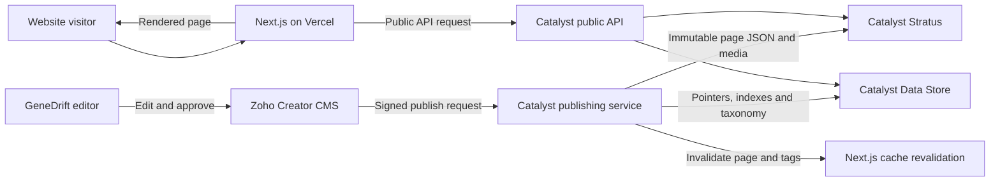
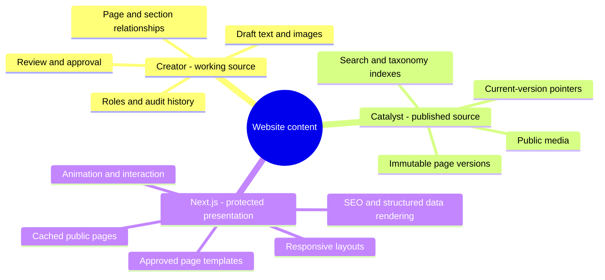
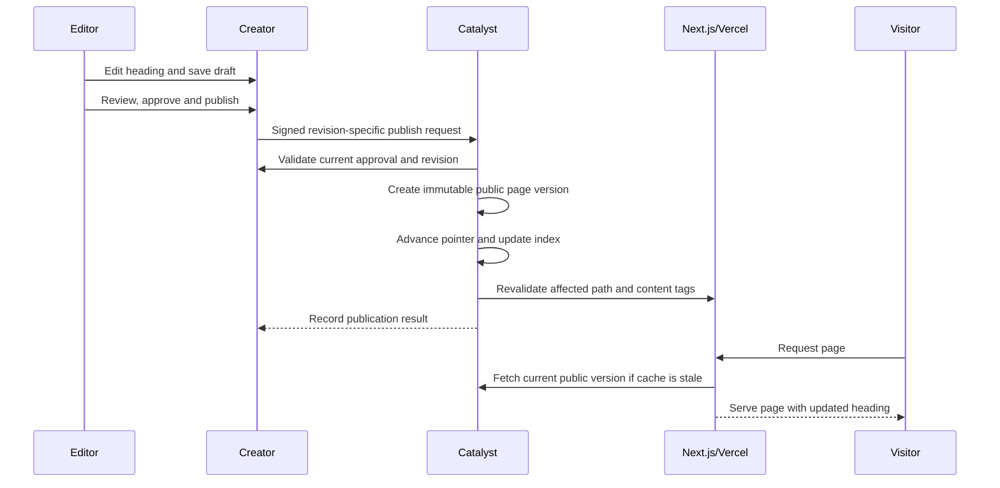
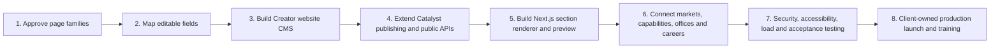

# GeneDrift Website Content Architecture Plan

Client Phase 2 baseline received on 2026-09-01. Read
`docs/PHASE_2_WEBSITE_REVAMP_CLIENT_BASELINE.md` before using this plan for any
new website design or development work.

## Decision

Use **Zoho Creator + Catalyst + Next.js/Vercel**.

- **Creator is the content workspace:** editors create, review, approve and publish website content.
- **Catalyst is the publishing and delivery layer:** it validates approved content, stores public versions and media, maintains indexes, and exposes the public API.
- **Next.js on Vercel is the presentation layer:** it renders the approved design and reads only the Catalyst public API.

Creator alone is sufficient for editing, but it should not be the public website database. Public pages must not call Creator for every visitor because that would couple site speed, availability, credentials and API limits to the editorial system.

Client customization requirement: the client should be able to update website
copy/sections from Creator, but those edits should become public only after
approval and publication into Catalyst. The production website should render
from Catalyst public APIs/cache, not directly from Creator.

## System architecture



## Where content lives



### Recommended Creator records

- `Website_Pages`: title, slug, page family, status, SEO and current revision.
- `Website_Page_Revisions`: the editable content for one revision.
- `Website_Sections`: approved section type, order, visibility and structured fields.
- Reusable collections: `Markets`, `Capabilities`, `Client_Success`, `Offices`, `FAQs`, `CTAs` and `Media_Assets`.
- Controlled relationships and taxonomies connect pages, markets, expertise, industries and insights.

Each published page becomes one structured public snapshot, for example:

```text
Page identity + slug + template
SEO title + description + social image
Ordered approved sections
Related markets + capabilities + insights
Publication version + timestamps
```

## What the client can edit

Editors can change:

- headings, paragraphs and labels;
- images, alt text and downloadable files;
- buttons, links and contact routes;
- SEO title, description and social image;
- approved section visibility and ordering;
- reusable market, capability, office and proof content.

The application protects:

- page-family layouts and design-system rules;
- responsive behaviour and accessibility;
- animations and interactive map logic;
- validation, security and integration code;
- unsupported section types or arbitrary HTML.

This is a structured CMS, not an unrestricted drag-and-drop builder.

## What happens when a heading is updated



Publishing should never edit the existing public object in place. It creates a new version and advances a pointer. This preserves rollback, auditability and safe cache refresh.

## Cache and update behaviour

1. Catalyst sends a secured on-demand revalidation request for the changed page and related listings.
2. Next.js refreshes the affected route and tagged data instead of rebuilding the entire website.
3. Catalyst responses retain ETags and CDN caching.
4. A short time-based refresh acts as a fallback if the revalidation callback fails.
5. Rollback republishes a previous immutable version and triggers the same cache refresh.

## Delivery roadmap



### Immediate next checkpoint

Before building the wider CMS, approve:

1. the final sitemap and reusable page families;
2. which fields are editable on each page family;
3. which sections can be reordered or hidden;
4. the preview, approval and publishing roles;
5. the selected visual direction and its component library.

The client's current requested first step is to prepare three sample
templates/design concepts: two aligned closely with the LF20 design philosophy
and corporate presentation, and one independent premium direction based on our
creative judgment. Use those concepts to select the design direction before
building the complete website.

The existing Blog/Insights pipeline should remain the reference implementation. The website-content system extends it with additional content types and page templates instead of creating a separate delivery architecture.
